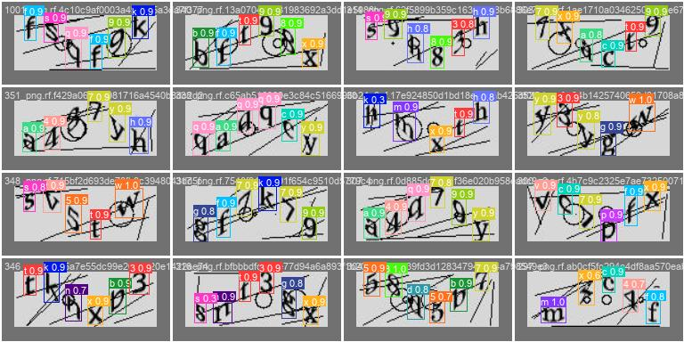

# CaptchaPLS

An AI model using YOLOv8 pre-trained object detection model with a custom dataset. Primarely used for cracking certain game's captchas :)

Hyperparameters using `model.tune(epochs=80,
        iterations=300,
        imgsz=(130, 50),
        save=False,
        val=False,
        batch=-1,)`:
```yaml
lr0: 0.01036
lrf: 0.0143
momentum: 0.8457
weight_decay: 0.00035
warmup_epochs: 1.33687
warmup_momentum: 0.83705
box: 4.03006
cls: 0.28956
dfl: 1.44355
hsv_h: 0.01913
hsv_s: 0.43485
hsv_v: 0.6064
degrees: 0.0
translate: 0.06675
scale: 0.54721
shear: 0.0
perspective: 0.0
flipud: 0.0
fliplr: 0.31589
mosaic: 0.39461
mixup: 0.0
copy_paste: 0.0
```


